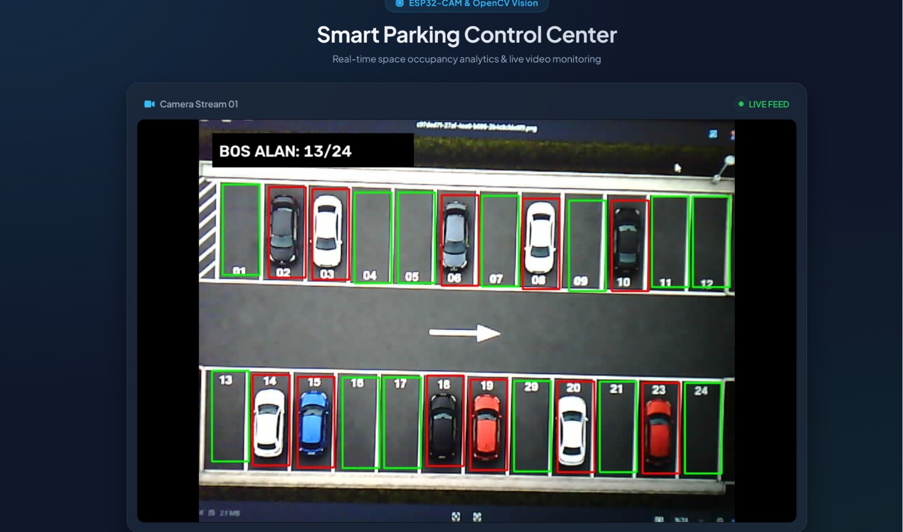

# 🅿️🅿🚘🚗Smart Parking Occupancy System
A real-time parking space occupancy tracking system built with ESP32-CAM, OpenCV, and Flask.

# About the Project
This project processes a live MJPEG video stream from a Deneyap Kart (ESP32-CAM) to detect open and occupied parking spots in real time.
While I initially considered deep learning models, I decided to go with OpenCV's Adaptive Thresholding technique to eliminate stream latency and keep frame rates high without needing a dedicated GPU. The occupancy metrics and processed stream are served live on a dark-mode web dashboard built with Flask.

# Tech Stack
Hardware: Deneyap Kart (ESP32 Camera Module)
Backend & Computer Vision: Python, OpenCV (Adaptive Thresholding)
Web Interface: Flask, HTML5, CSS3
Storage / Config: Pickle (CarParkPos)

# Key Features
Live Wireless Streaming: Direct MJPEG stream ingestion from the ESP32-CAM over Wi-Fi.
Lightweight & High-FPS Detection: Accurate occupancy tracking using OpenCV pixel density analysis, designed to run smoothly on standard CPUs.
Interactive Parking ROI Picker: A helper script (space_picker.py) that lets you click to define and save parking slot coordinates.
Web Dashboard: A simple browser interface displaying real-time available spot counts and visual bounding boxes.
Stream Fault Tolerance: Basic auto-reconnect handling to recover gracefully if the Wi-Fi camera stream briefly drops.
